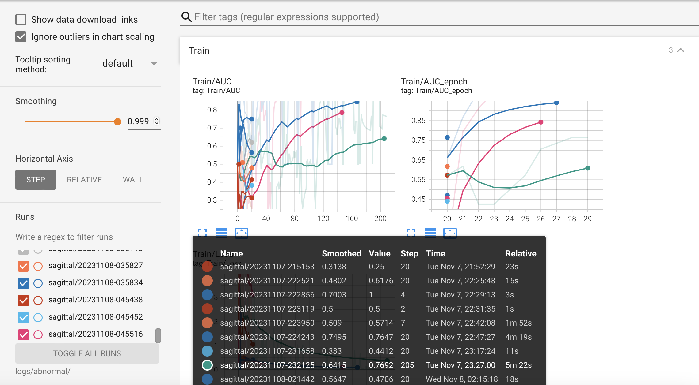

## How to use the code:

If you want to retrain the network on your own you have to ask for the data from Stanford via this <a href="https://stanfordmlgroup.github.io/competitions/mrnet/">link</a>.

Otherwise you can download it from <a href="https://drive.google.com/drive/folders/1cmZhviZnH6GOqRXTQBb90z2HkjZ7ZSv3">gdrive link</a>

Once you download the data, create a `data` folder and place it at the root of the project. You should have two folders inside: `train` and `valid` as well as a bunch of csv files.

To run the script you can execute it with the following arguments:


```python
parser = argparse.ArgumentParser()
parser.add_argument('-t', '--task', type=str, required=True,
                    choices=['abnormal', 'acl', 'meniscus'])
parser.add_argument('-p', '--plane', type=str, required=True,
                    choices=['sagittal', 'coronal', 'axial'])
parser.add_argument('--prefix_name', type=str, required=True)
parser.add_argument('--augment', type=int, choices=[0, 1], default=1)
parser.add_argument('--lr_scheduler', type=str,
                    default='plateau', choices=['plateau', 'step'])
parser.add_argument('--gamma', type=float, default=0.5)
parser.add_argument('--epochs', type=int, default=50)
parser.add_argument('--lr', type=float, default=1e-5)
parser.add_argument('--flush_history', type=int, choices=[0, 1], default=0)
parser.add_argument('--save_model', type=int, choices=[0, 1], default=1)
parser.add_argument('--patience', type=int, default=5)
parser.add_argument('--log_every', type=int, default=100)
```

example to train a model to detect acl tears on the sagittal plane for a 20 epochs:

`python train.py -t acl -p sagittal --prefix_name demo --epochs=20`

Note: Before running the script, add the following (empty) folders at the root of the project:
- models
- logs


## Evaluating fit:

Using tensorboard to visualize the training and validation data:


```
tensorboard --logdir logs/abnormal

#You can add: /{sagittal/axial/coronal} for a more drilled down observation
```



You are able to select the various models you wish to compare and smoothing parameters for visualization.